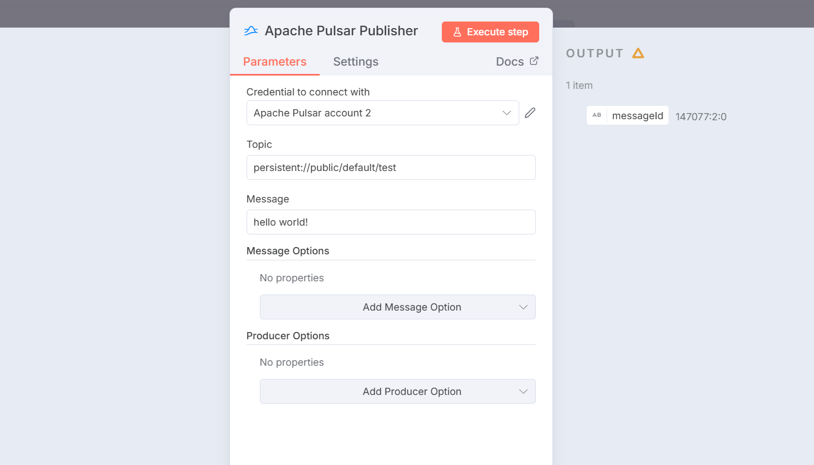
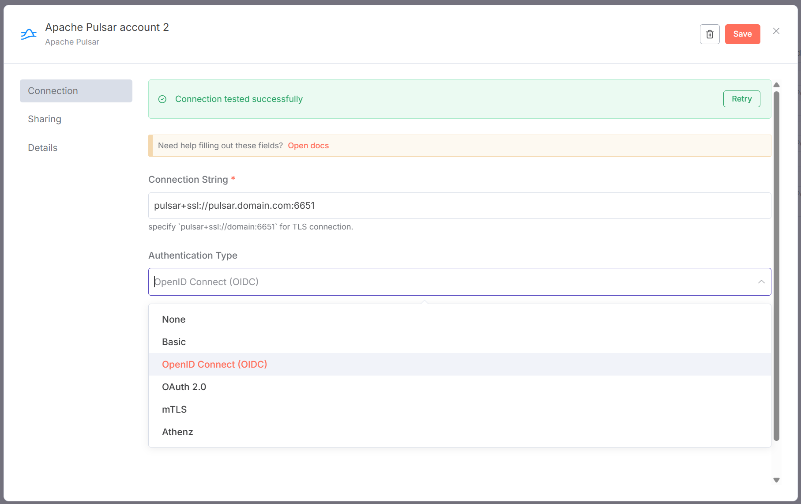

# n8n-nodes-pulsarproducer

This is an n8n community node. It is used to publish messages to Apache Pulsar.!

[n8n](https://n8n.io/) is a [fair-code licensed](https://docs.n8n.io/reference/license/) workflow automation platform.

## What makes this node unique?

This node is built on [@pulsar-js/producer](https://github.com/pulsar-js/producer) instead of the official [pulsar-client](https://www.npmjs.com/package/pulsar-client) module.

The official pulsar client module is a wrapper around the Pulsar C++ library. Native Node.js modules are notoriously difficult to setup because they require a compiler (used by node-gyp) to handle the build step. This can be a blocking barrier in environments that do not allow extra build tools.

The [@pulsar-js/producer](https://github.com/pulsar-js/producer) module, which was written for this node, uses a [pre-built binary](https://github.com/pulsar-js/producer-bin). This eliminates the need for a C++ compiler. The pre-built binary is written in Go using the official Pulsar Go client.

## Table of Contents

1. [Installation](#installation)
1. [Credentials](#credentials)
1. [Compatibility](#compatibility)
1. [Usage](#usage)
1. [Resources](#resources)
1. [Development](#development)

## Installation

Follow the [installation guide](https://docs.n8n.io/integrations/community-nodes/installation/) in the n8n community nodes documentation. This module is named `n8n-nodes-pulsarproducer`.

## Credentials

This module supports the following Pulsar authentication strategies:

- None
- Basic Auth
- OpenID Connect (OIDC)
- Mutual TLS (mTLS)
- OAuth2
- Athenz

## Compatibility

This node was written and tested in the following environment:

- n8n v1.108.1
- platform: npm
- Node.js v24.0.0
- database: sqlite
- executionMode: regular
- concurrency: -1
- license: community

## Usage

This node is designed for node workflows that need to publish individual messages.

A new connection is established for each message/batch sent (no connection pooling). Once a message is sent, the connection is dropped. This is not ideal for platforms that send a constant stream of messages or need the absolute lowest possible latency. However; if you need to send <500 messages per minute, the latency is negligble (<1ms) and the connections are lightweight. The limiting factor is much more likely to be your Pulsar cluster capacity than these ephemeral connections.

## Resources

* [n8n community nodes documentation](https://docs.n8n.io/integrations/#community-nodes)
* [@pulsar-js/producer](https://github.com/pulsar-js/producer) (underlying npm module)
* [prebuilt binaries](https://github.com/pulsar-js/producer-bin)

## Development

I created this node because I couldn't install the alternatives in a restricted n8n environment. Additionally, the existing Pulsar nodes for n8n did not fully support OIDC, which is something I needed at the time of creation.

Copyright &copy; 2025, [Corey Butler](https://github.com/coreybutler). MIT License.